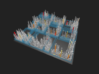

Troika is a JavaScript framework that simplifies the creation of interactive graphics in the browser, with a focus on 3D/WebGL, and optimized for data visualization use cases.

It provides:

* A component architecture that encapsulates complex graphics APIs behind simple facade objects
* Declarative description of the scene's structure and how it should change over time
* CSS-like declarative animations and transitions
* DOM-like interaction event handling
* Performance optimizations

Troika's main goal is to take aspects of developing interactive graphics that you almost always need, but are difficult to manage yourself, and make them as easy as possible.

## Troika core

At its core, Troika manages a simple mapping from a declarative scene descriptor to a tree of special objects called [_Facades_](troika-core/facades.md). Each `Facade` is a component that knows how to synchronize its state, set as flat properties by the scene descriptor, to a more complex underlying API.

On top of that, Troika builds in some things like an event subscription model and declarative animations and transitions for facade properties.

[Learn more about Troika core concepts.](troika-core/facades.md)

## Troika 3D

Creating interactive 3D scenes with WebGL is Troika's first focus. It uses [Three.js](https://threejs.org) for the heavy lifting of managing WebGL state, and for its solid scene graph model, 3D primitives and math utilities, and shader library.

Troika manages the Three.js renderer and common things like world matrix calculations and raycasting for pointer events. Otherwise, it has no knowledge of any 3D primitives; it's up to you to set up your Three.js meshes, geometries, materials, etc. and update them in your `Object3DFacade` implementations. A solid understanding of Three.js's model is therefore still required.

As a very rough analogy: if Three.js provides a DOM for WebGL, then you could consider Troika to be like ReactJS for managing that DOM. It simplifies things, but you still need to know the DOM.

Troika 3D also provides some more advanced capabilities like: position-synced [HTML overlays](troika-3d/html-overlays.md), an easy-to-use [GPU instancing](troika-3d/instancing.md) abstraction, high quality [3D text rendering](troika-three-text/index.md), utilities for [manipulating shaders](troika-three-utils/createDerivedMaterial.md), and [WebXR support](troika-xr/index.md).

[Learn more about Troika 3D.](troika-3d/index.md)

## Troika 2D

As a separate package, Troika also provides the ability to define using the 2D Canvas API, using the same scene/facade patterns and core conveniences like animations and pointer events.

This can be nice on its own when you don't need 3D, but is also useful as a graceful fallback for when WebGL isn't available in the browser.

[Learn more about Troika 2D.](troika-2d/index.md)

## Framework integration

Currently, Troika provides React components (`Canvas3D` and `Canvas2D`) that allow you to describe your scenes within the standard React lifecycle, using the state and event handlers from the parent React component.

The responsibilities of the wrapper layer have been kept as narrow as possible, so it should be simple to write wrappers for other frameworks as needed. Contributions are welcome.

## Browser support

Troika should be able to run in the same browsers as Three.js does. See the [Three.js browser support](https://threejs.org/docs/#manual/en/introduction/Browser-support) docs for more details.

Its source files are ES2015 modules, and can be used un-transpiled in modern browsers supporting `<script type="module">`, though you'll probably still want to combine/tree-shake them with a module-aware build pipeline like [Webpack](https://webpack.js.org/) or [Rollup](https://rollupjs.org/). For older browsers, ES5-transpiled files are provided.

