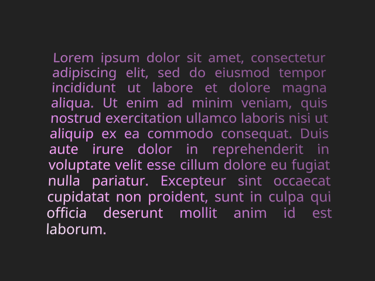

# `troika-3d-text`

This package provides high quality text rendering in 3D scenes, using signed distance fields (SDF) and antialiasing using standard derivatives.

Rather than relying on pre-generated SDF textures, this parses font files (.ttf, .otf, .woff) directly using [Typr.js](https://github.com/photopea/Typr.js), and generates the SDF atlas for glyphs on-the-fly as they are used. It also handles proper kerning and ligature glyph substitution. All font parsing, SDF generation, and glyph layout is performed in a web worker to prevent frame drops.

Once the SDFs are generated, it assembles a geometry that positions all the glyphs, and _patches_ any Three.js Material with the proper shader code for rendering the SDFs. This means you can still benefit from all the features of Three.js's built-in materials like lighting, physically-based rendering, shadows, and fog.

## Demo

Here's [an online demo](https://troika-examples.netlify.com/#text).

## Screenshots




## Installation

Get it from [NPM](https://www.npmjs.com/package/troika-3d-text):

```sh
npm install troika-3d-text
```

You will also need to install a compatible version of [Three.js](https://threejs.org); see the notes in the [Troika 3D Readme](../troika-3d/README.md#installation) for details.

## Usage

### Using within the Troika 3D scene management framework

This library is built first and foremost to work within Troika 3D scenes, via the `Text3DFacade` class.

```js
import {Text3DFacade} from 'troika-3d-text'
```

...then within your scene descriptor:

```js
{
  key: 'my-text',
  facade: Text3DFacade,
  text: 'Hello world!',
  fontSize: 0.2,
  color: 0x9966FF,
  z: -2
  // ...etc.
}
````

### Using standalone with Three.js

The `Text3DFacade` mentioned above is just a wrapper around a Three.js `TextMesh` object, which you can also use directly outside of the Troika framework. A special build file is provided in the distribution that includes only the necessary dependencies:

```js
import {TextMesh} from 'troika-3d-text/dist/textmesh-standalone.esm.js'
````

You can then use the `TextMesh` class like any other Three.js mesh:

```js
const textMesh = new TextMesh()
myScene.add(textMesh)

// set properties to configure:
textMesh.text = 'Hello world!'
textMesh.fontSize = 0.2
textMesh.position.z = -2
textMesh.color = 0x9966FF

// be sure to call sync() after all properties are set to update the rendering:
textMesh.sync()
```

When you're done with the `TextMesh` instance, be sure to call `dispose` on it to prevent a memory leak:

```js
myScene.remove(textMesh)
textMesh.dispose()
```

### Using in other frameworks

Some examples of using the standalone TextMesh within other frameworks:

* [With react-three-fiber](https://codesandbox.io/embed/troika-3d-text-via-react-three-fiber-ntfx2?fontsize=14)
* [As an A-Frame component](https://github.com/lojjic/aframe-troika-text)

## Supported properties

Both `Text3DFacade` and `TextMesh` support the following properties for controlling the text rendering:

#### `text`

The string of text to be rendered. Newlines and repeating whitespace characters are honored.

Default: _none_

#### `anchor`

This property is deprecated as of version 0.24.0; use `anchorX` and `anchorY` instead.

#### `anchorX`

Defines the horizontal position in the text block that should line up with the local origin. Can be specified as a numeric `x` position in local units, a string percentage of the total text block width e.g. `'25%'`, or one of the following keyword strings: `'left'`, `'center'`, or `'right'`.

Default: `0`

#### `anchorY`

Defines the vertical position in the text block that should line up with the local origin. Can be specified as a numeric `y` position in local units (note: down is negative y), a string percentage of the total text block height e.g. `'25%'`, or one of the following keyword strings: `'top'`, `'top-baseline'`, `'middle'`, `'bottom-baseline'`, or `'bottom'`.

Default: `0`

#### `clipRect`

If specified, defines the `[minX, minY, maxX, maxY]` of a rectangle outside of which all pixels will be discarded. This can be used for example to clip overflowing text when `whiteSpace='nowrap'`.

Default: _none_

#### `color`

This is a shortcut for setting the `color` of the text's `material`. You can use this if you don't want to specify a whole custom `material` and just want to change its color.

Use the `material` property if you want to control aspects of the material other than its color.

Default: _none_ - uses the color of the `material`

#### `depthOffset`

This is a shortcut for setting the material's [`polygonOffset` and related properties](https://threejs.org/docs/#api/en/materials/Material.polygonOffset), which can be useful in preventing z-fighting when this text is laid on top of another plane in the scene. Positive numbers are further from the camera, negatives closer.

Be aware that while this can help with z-fighting, it does not affect the rendering order; if the text renders before the content behind it, you may see antialiasing pixels that appear too dark or light. You may need to also change the text mesh's `renderOrder`, or set its `z` position a fraction closer to the camera, to ensure the text renders after background objects.

Default: `0`

#### `font`

The URL of a custom font file to be used. Supported font formats are:
* .ttf
* .otf
* .woff (.woff2 is _not_ supported)

Default: The *Roboto* font loaded from Google Fonts CDN

#### `fontSize`

The em-height at which to render the font, in local world units.

Default: `0.1`

#### `letterSpacing`

Sets a uniform adjustment to spacing between letters after kerning is applied, in local world units. Positive numbers increase spacing and negative numbers decrease it.

Default: `0`

#### `lineHeight`

Sets the height of each line of text. Can either be `'normal'` which chooses a reasonable height based on the chosen font's ascender/descender metrics, or a number that is interpreted as a multiple of the `fontSize`.

Default: `'normal'`

#### `material`

Defines a Three.js Material _instance_ to be used as a base when rendering the text. This material will be automatically replaced with a new material derived from it, that adds shader code to decrease the alpha for each fragment (pixel) outside the text glyphs, with antialiasing.

By default it will derive from a simple white `MeshBasicMaterial, but you can use any of the other mesh materials to gain other features like lighting, texture maps, etc.

Also see the `color` shortcut property.

Default: a `MeshBasicMaterial` instance

#### `maxWidth`

The maximum width of the text block, above which text may start wrapping according to the `whiteSpace` and `overflowWrap` properties.

Default: `Infinity`, meaning text will never wrap

#### `overflowWrap`

Defines how text wraps if the `whiteSpace` property is `'normal'`. Can be either `'normal'` to break at whitespace characters, or `'break-word'` to allow breaking within words.

Default: `'normal'`

#### `textAlign`

The horizontal alignment of each line of text within the overall text bounding box. Can be one of `'left'`, `'right'`, `'center'`, or `'justify'`.

Default: `'left'`

#### `whiteSpace`

Defines whether text should wrap when a line reaches the `maxWidth`. Can be either `'normal'`, to allow wrapping according to the `overflowWrap` property, or `'nowrap'` to prevent wrapping.

Note that `'normal'` in this context _does_ honor newline characters to manually break lines, making it behave more like `'pre-wrap'` does in CSS.

Default: `'normal'`


## Preloading

To avoid long pauses when first displaying a piece of text in your scene, you can preload fonts and optionally pre-generate the SDF textures for particular glyphs up front:

```js
import {preloadFont} from 'troika-3d-text'

myApp.showLoadingScreen()

preloadFont(
  'path/to/myfontfile.woff', 
  'abcdefghijklmnopqrstuvwxyz',
  () => {
    myApp.showScene()
  }
)
```

The arguments are:

- `font` - The URL of the font file to preload. If `null` is passed, this will preload the default font.

- `charSequences` - A string or array of string character sequences for which to pre-generate glyph SDF textures. Note that this _will_ honor ligature substitution, so you may need to specify ligature sequences in addition to their individual characters to get all possible glyphs, e.g. `["t", "h", "th"]` to get the "t" and "h" glyphs plus the "th" glyph.

- `callback` - A function that will be called when the preloading is complete.


## Carets and Selection Ranges

In addition to rendering text, it is possible to access positioning information for caret placement and selection ranges. To access that info, use the `getCaretAtPoint` and `getSelectionRects` utility functions. Both of these functions take a `textRenderInfo` object as input, which you can get from the `TextMesh` object either in the `sync()` callback or from its `textRenderInfo` property after sync has completed.

#### `getCaretAtPoint(textRenderInfo, x, y)`

This returns the caret position nearest to a given x/y position in the local text plane. This is useful for placing an editing caret based on a click or ther raycasted event. The return value is an object with the following properties:

- `x` - x position of the caret
- `y` - y position of the caret's bottom
- `height` - height of the caret, based on the current fontSize and lineHeight
- `charIndex` - the index in the original input string of this caret's target character. The caret will be for the position _before_ that character. For the final caret position, this will be equal to the string length. For ligature glyphs, this will be for the first character in the ligature sequence.

#### `getSelectionRects(textRenderInfo, start, end)`

This returns a list of rectangles covering all the characters within a given character range. This is useful for highlighting a selection range. The return value is an array of objects, each with `{left, top, right, bottom}` properties in the local text plane.
